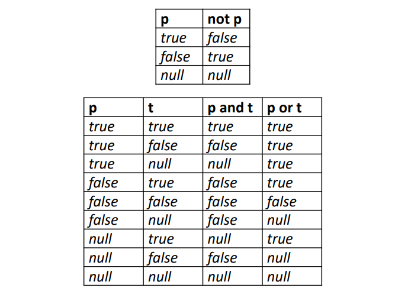
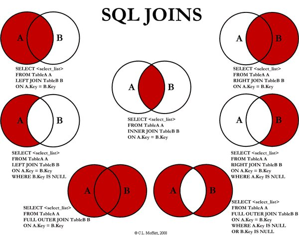

# BP 2023/'24. Cheatsheet 
## 1. Podaci
1. Cjelobrojni
   1. tinyint - 1B
   2. smallint - 2B
   3. mediumint - 3B
   4. int - 4B
   5. bigint - 8B
2. Racionalni
   1. decimal(total, decimals)
   2. numeric(total, decimals)
   3. fixed(total, decimals)
3. Numericki (aproksimativni)
   1. real
   2. double
   3. double precision
   4. float(decimals)
4. Nizovi znakova
   1. char(n)
   2. varchar(n)
   3. text
5. Binarni
   1. tinyblob
   2. blob
   3. mediumblob
   4. longblob
6. Datumski/vremenski
   1. date
   2. datetime
   3. timestamp
   4. time
   5. year
7. Logicki
   1. boolean == tinyint(1)
8. Ostali:
   1. enum
   2. set
   3. json

## 2. DDL
### 3.1. CREATE TABLE
```sql
create schema naziv;
```

```sql
use naziv_seme;
```

```sql
create table tabela (
  naziv_kolone1 tip_podatka [ograničenje_za_kolonu1],
  naziv_kolone2 tip_podatka [ograničenje_za_kolonu2],
  ...
  naziv_koloneN tip_podatka [ograničenje_za_kolonuN]
  [, integritetsko_ograničenje1]
  [, integritetsko_ograničenje2]
  ...
  [, integritetsko_ograničenjeM]
)
```

```sql
create table tabela (
  ...
  primary key (pk1, pk2, ..., pkN)
)

-- ili (ako je primarni kljuc singularan)
create table tabela (
  kolona1 tip_podatka primary key;
)
```

```sql
foreign key (fk1, fk2, ..., fkN)
references strana_tabela (kolona1, kolona2, ..., kolonaN)
```

Kreiranje tabele `fakultet`:
```sql
create table fakultet (
  NazivFakulteta varchar(50) primary key,
  Adresa varchar(50) not null
)
```

Surogat kljuc:
```sql
create table fakultet (
  IdFakulteta int auto_increment primary key,
  NazivFakulteta varchar(50) not null,
  Adresa varchar(50) not null
)
```

Kreiranje tabele `predmet`:
```sql
create table predmet (
  IdPredmeta int,
  NazivPredmeta varchar(50) not null,
  ECTS tinyint not null,
  NazivFakulteta varchar(50) not null,
  
  constraint check_ECTS
  check (ECTS > 0),
  
  primary key (IdPredmeta),
  constraint FK_predmet_fakultet
  foreign key (NazivFakulteta)
  references fakultet (NazivFakulteta)
  on update cascade on delete restrict
)
```

Akcije brisanja i azuriranja pri definiciji stranog kljuca:
- `cascade` - kaskadno azuriranje
- `set null`
- `no action`
- `restrict` - default u MySQL, 
- `set default` - nepodrzano u MySQL

### 3.2. ALTER

```sql
alter table tabela add column naziv_kolone tip_podatka [ogranicenja];
alter table tabela add column naziv_kolone tip_podatka set default {vrijednost};
alter table tabela add column naziv_kolone drop default;
alter table tabela modify column naziv_kolone novi_tip [nova_ogranicenja];
alter table tabela change column naziv_kolone novi_naziv novi_tip_podatka [nova_ogranicenja];
```

```sql
alter table tabela drop column naziv_kolone;
alter table tabela add primary key (pk1, pk2, ..., pkN);
alter table tabela drop primary key;
```

```sql
alter table tabela add [constraint ogranicenje]
foreign key (fk1, fk2, ..., fkN)
references ref_tabela (col1, col2, ..., colN);
```

```sql
alter table tabela drop foreign key ogranicenje;
```

### 3.3. INDEX
```sql
alter table tabela add {?unique} index naziv_indeksa (
  kolona1 {asc | desc},
  ?[, kolona2 {asc | desc}, ...]
);
```

## 3. DML
upit - ekstrakcija podataka iz baze i prikaz u tabelarnoj formi  
sastoji se od minimalno dvije klauzule: `select` i `from`, dok je `where` opciono

### 3.1. SELECT
```sql
select [all/distinct?] [kolona1, kolona2, ..., kolonaN] from [tabela] (where [uslov]?)
```

### 3.1.1. WHERE
operatori poredjenja: `=`, `<>`, `<`, `<=`, `>` i `>=`   
logicki operatori:
  - `not`
  - `and`
  - `or` 

between se takodje moze koristiti:
```sql
where X between A and B;
```

pretrazivanje pripadanja po skupu:
```sql
where X in (a1, ..., aN);
```

pretrazivanje stringova po uzorkovanju `like`:
  - `%` - nula ili vise znakova bilo kog niza
  - '_' - tacno jedan bilo koji znak

```sql
where string like '%ina';
```

preimenovanje/obrada kolone `as`:
```sql
select (k1, abs(k2), round(k3, 2)) as procesirano from tabela;
```

neke od funkcija:
1. algebarske
   1. abs(b)
   2. mod(b, d)
   3. pow(b, n)
   4. sqrt(b)
   5. round(b, d)
   6. truncate(b, d)
2. stringmanip
   1. upper(s)
   2. lower(s)
   3. char_length(s)
   4. concat(s1, ..., sN)
   5. substr(s, p, d)
   6. trim(s)
3. datemanip
   1. str_to_date(s, f)
   2. date_format(d, f)
   3. day(d)
   4. month(d)
   5. year(d)
   6. hour(t)
   7. minute(t)
   8. second(t)
   9. sysdate() - trenutno vrijeme
4. agregatne - vracaju jednu skalarnu vrijednost
   1. count(*)
   2. count(n) ili count(all n)
      1. count(distinct n)
   3. sum(n) ili sum(all n)
      1. sum(distinct n)
   4. avg(n) ili avg (all n)
      1. avg(distinct n)
   5. max(n)
   6. min(n)

### 3.1.2. CASE
```sql
case
  when uslov1 then rez1
  [, when uslov2 then rez2, ...]?
  [else rezN]?
end


case
  when izraz1 then rez1
  [, when izraz2 then rez2, ...]?
  [else rezN]?
end
```

### 3.1.3. ORDER BY
podrazumijeva se rastuci (`asc` redoslijed) -> `asc` ili `desc`  
```sql
select year(datum) as godina, ime_prezime
from osoba
order by godina desc, ime_prezime asc
```


### 3.1.4. Null vrijednosti
`is null var1` -> vraca logicku vrijednost  
logicke operacije nad null vrijednostima mogu vratiti `null`, `true` ili `false`:



`coalesce(v1, ..., vN)` - vraca prvu ne-null vrijednost, ili null ako su sve null   


### 3.1.5. Agregatne funkcije
```sql
-- prikazuje ukupan broj nastavnika koji nemaju sefa katedre
select count(*) as ukupno
from nastavnik
where jmb_sefa_katedre is null;
```

### 3.1.6. HAVING
specificira uslov koji svaka grupa mora da zadovolji da bi pripadala rezultatu:
```sql
select zvanje, round(avg(plata), 2) as prosjek
from nastavnik

-- grupisanje po zvanju koje ima bar tri nastavnika
group by zvanje
having count(*) >= 3;
```

### 3.1.7. Spajanje tabela (bez JOIN)
- `from` klasicno spaja tabele koristenjem Dekartovog proizvoda
- `select`-`project`-`join`: nmg skontat


## 3.2. JOIN
- objedinjavanje specifikacije Dekartovog proizvoda i uslova spajanja u from klauzuli upita
- u `where` klauzuli se specifikuju samo uslovi selekcije
- uslovi spajanja u `from` se specifikuju `join` operatorom (u razlicitim varijantama), cime se kao rezultat procesiranja `from` klauzule dobija jedna, spojena tabela
- vrste spajanja su:
  1. inner join
  2. left (outer) join
  3. right (outer) join
  4. full outer join
  5. cross join (cartesian join)
     - *joins each row of one table to every row of another table*
     - *happens when the matching column or the WHERE condition are not specified*
     - *result-set of a CROSS join is the product of the number of rows of the joined tables*
- uslovi spajanja mogu biti:
  1. natural
  2. on *uslov*
  3. using (k1, k2, ..., kN)




## 4. Pravila mapiranja (konceptualni -> relacioni)
1. Jaki entitetski tipovi
   - generise se relaciona sema sa svim prostim atributima i prostim komponentama njegovih kompozitnih atributa
   - atribute primarnog kljuca su primarni kljuc relacione seme
```sql
create table fakultet (
  naziv varchar(50),
  adresa varchar(50) not null,
  
  primary key (naziv)
);
```

2. Slabi entitetski tipovi
   - mora biti identifikovan primarnim kljucem identifikujuceg entitetskog tipa
   - sadrzi sve atribute i proste komponente kompozitnih atributa, te primarni kljuc identifikujuceg entitetskog tipa (kao strani kljuc)

```sql
create table telefon (
  naziv varchar(50),
  telefon varchar(20),
  
  primary key (naziv, telefon),
  
  constraint FK_telefon_fakultet
  foreign key (naziv)
  references fakultet (naziv)
);
```

3. Specijalizacije
  1. **Vertikalno**
      - sadrzi sve atribute superklase, koji su ujedno primarni kljuc
      - za sve specijalizacije (totalne/parcijalne, disjunktne/preklapajuce)
```sql
create table base (
  id int auto_increment,
  foo text,
  
  primary key (id)
);

create table extended (
  id int,
  foo text,
  bar float,
  
  primary key (id, foo),
  
  constraint FK_extended_base
  foreign key (id, foo)
  references base (id, foo)
);
```

  2. **Horizontalno** 
     - potklasa sadrzi sve atribute (atomicne i komponente kompozitnih), kao i primarni kljuc superklase
     - primarni kljuc potklase == primarni kljuc superklase
     - samo kod totalne i disjunktne specijalizacije 
```sql
create table base (
  id int auto_increment,
  foo text,
  
  primary key (id)
);

create table extended (
  id int auto_increment,
  foo text,
  bar float,
  
  primary key (id)
);
```

  3. **Junction table** (*sa diskriminatorom*)
     - nesto fazon ko enumeracija 
     - jedna relaciona sema za superklasu i sve potklase
     - ukljucuje uniju svih prostih atributa superklase i potklasa (i proste kompozitnih)
     - nije moguce specifikovati `not null` na specificnim atributima potklasa
     - ako je disjunktna - dodatni diskriminirajuci atribut nije potreban
     - ako nije disjunktna - PK relacione seme je unija PK superklase i diskriminatora
```sql
create table vozilo (
  id int primary key,
  model varchar(50),
  tip varchar(20) not null,
  
  -- osobina automobila (null ako je kamion)
  spojler tinyint(1),
  
  -- osobina kamiona (null ako je automobil)
  kaca tinyint(1),
  
  -- 'tip' je diskriminator
  constraint CHK_tip
  check (tip in ('automobil', 'kamion'))
)
```

  4. **Junction table** (*sa vise indikatorskih atributa*)
     - jedna relaciona sema za superklasu i sve potklase
     - unija svih prostih atributa superklase i potklase (i proste kompozitnih)
     - ukljucuje i dodatne indikatorske atribute `F1, ..., Fm` za sve potklase `E1, ..., Em`

4. Unije
   - generise se posebna sema koja sadrzi vjestacki/surogat kljuc
   - ako unija nasljedjuje neku superklasu, tada se i superklasa treba prosiriti surogat kljucem, proglasen kao strani kljuc

```sql
create table unija (
  id int auto_increment primary key,
  a1 int,
  a2 text,
  a3 float,
  a4 timestamp
)

create table superklasa (
  pk1 int,
  pk2 int,
  b1 int,
  b2 decimal(4,2),
  
  id int,
  
  primary key (pk1, pk2, id)
)
```

5. Binarne veze kardinalnosti M:M
   - generise se vezna relaciona sema
   - ukljucuje atribute primarnih kljuceva ucestvujucih entitetskih tipova
   - ukljucuje sve proste i komponente kompozitnih atributa
   - primarni kljuc je unija primarnih kljuceva entitetskih tipova
   - sadrzi dva strana kljuca: FK1 = primarni kljucevi relacione seme entitetskog tipa X, FK2 = primarni kljucevi relacione seme entitetskog tipa Y

```sql
create table X (
  x_pk1 int,
  x_pk2 int,
  x_attr1 datetime,
  
  primary key (x_pk1, x_pk2)
);

create table Y (
  y_pk1 int,
  y_pk2 int,
  y_attr1 float,
  
  primary key (y_pk1, y_pk2)
);

create table R (
  x_pk1 int,
  x_pk2 int,
  x_attr1 int,
  
  y_pk1 int,
  y_pk2 int,
  y_attr1 float,
  
  primary key (x_pk1, x_pk2, y_pk1, y_pk2),
  
  constraint FK_R_X
  foreign key (x_pk1, x_pk2)
  references X (x_pk1, x_pk2),
  
  constraint FK_R_Y
  foreign key (y_pk1, y_pk2)
  references Y (y_pk1, y_pk2)
);
```

6. Binarne veze kardinalnosti 1:M
   1. Participacija Y sa M strane **je totalna**
      - u relacionu semu za Y dodaju atributi primarnog kljuca X (ucesce X je na strani 1), koji se koriste kao strani kljuc
      - ukoliko veza ima opisne atribute, oni se takodje ukljucuju u relacionu semu za Y

```sql 
create table X (
  x_pk int,
  x_a int,
  
  primary key (x_pk)
);

create table Y (
  y_pk int,
  y_a int not null,
  
  opisni_atribut int,
  
  primary key (y_pk),
  
  constraint FK_Y_X
  foreign key (x_pk)
  references X (x_pk)
);
```

   2. Participacija Y sa M strane **nije totalna**
      1. isto kao i pod 6.1.), s tim da se za atribute od Y ne smije definisati `not null`
      2. slicno kao i kod M:M, s tim da su atributi relacione seme atributi primarnog kljuca Y

```sql
create table X (
  x_pk int,
  x_a int,
  
  primary key (x_pk)
);

create table Y (
  y_pk1 int,
  y_pk2 int,
  y_a int not null,
  
  primary key (y_pk1, y_pk2)
);

create table R (
  x_pk int,
  x_a int,
  
  y_pk1 int,
  y_pk2 int,
  y_a int not null,
  
  opisni_atribut int,
  
  primary key (y_pk1, y_pk2),
  
  constraint FK_R_X
  foreign key (x_pk)
  references X (x_pk)
)
```

7. Mapiranje 1:1
   1. Ucesce **Y je totalno** - koristi se primjena stranog kljuca (6.1.)
   2. Ucesce **X i Y je totalno** 
      1. primjena stranog kljuca (6.1.)
      2. spajanje relacija: kombinovanje X, Y i R u jednu relacionu semu
   3. Nijedno ucesce **nije totalno**: slicno kao i kod 1:M
      1. koristenje stranog kljuca
      2. formiranje vezne relacione seme

8. Mapiranje n-arnih tipova veze
   - kreira se RS koja ukljucuje atribute primarnih kljuceva i opisne atribute entitetskih tipova
   - atributi generisane RS su atributi primarnog kljuca tipa veze (podskup primarnih kljuceva ucestvujucih entitetskih tipova)
```sql
create table profesor (
  profesor_id int,
  naziv text,
  
  primary key (profesor_id)
);

create table student (
  student_id int,
  naziv text,
  
  primary key (student_id)
);

create table predmet (
  predmet_id int,
  naziv text,
  
  primary key (naziv)
);

create table ocjena (
  profesor_id int,
  student_id int,
  predmet_id int,
  
  -- opisni atributi veznog tipa R
  ocjena decimal(3, 2),
  datum date,
  
  
  primary key (profesor_id, student_id, predmet_id),
  
  constraint FK_ocjena_profesor
  foreign key profesor_id
  references profesor (profesor_id),
  
  constraint FK_ocjena_student
  foreign key student_id
  references student (student_id),
  
  constraint FK_ocjena_predmet
  foreign key predmet_id
  references predmet (predmet_id)
);
```

9. Agregacije
   - vezni tip koji se tretira kao agregacija se prvo mapira po pravilima binarnog ili n-arnog tipa veze
   - prilikom povezivanja agregacije ona se tretira kao entitetski tip viseg nivoa

10. Viseznacni atributi
    - kreira se posebna relaciona sema V
    - u V se dodaju atributi primarnog kljuca relacione seme entitetskog tipa kojoj viseznaci atribut M pripada

```sql
create table fakultet (
  naziv varchar(50) primary key
);

create table telefon (
  -- komponente viseznacnog atributa
  telefon varchar(16) unique not null,
  
  -- strani kljuc referencirane tabele
  naziv varchar(50),
  
  constraint FK_telefon_fakultet
  foreign key (naziv)
  references fakultet (naziv)
)
```