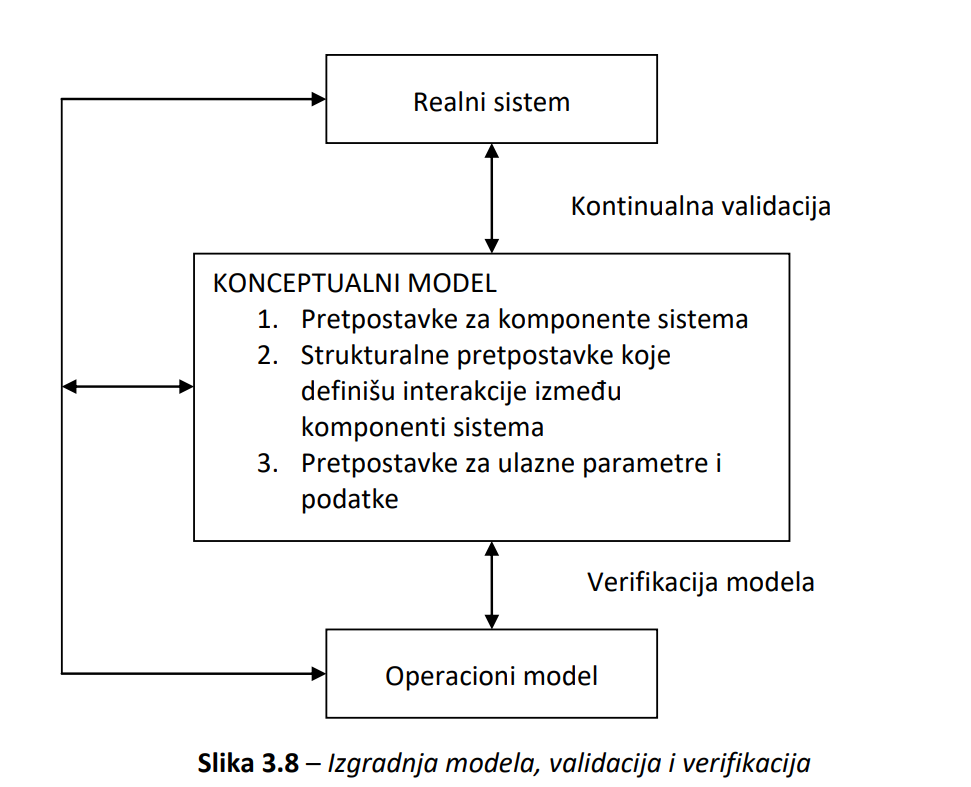
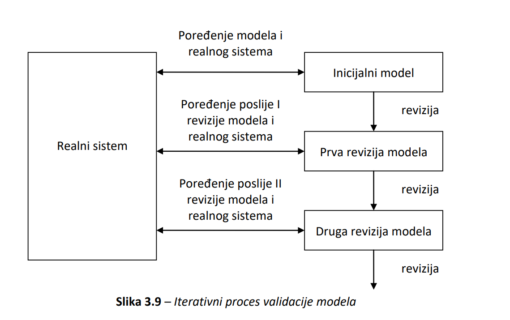
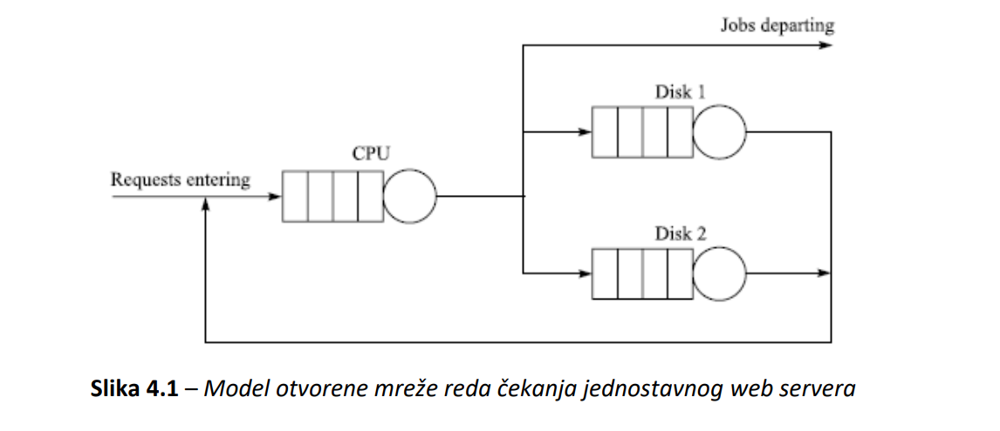
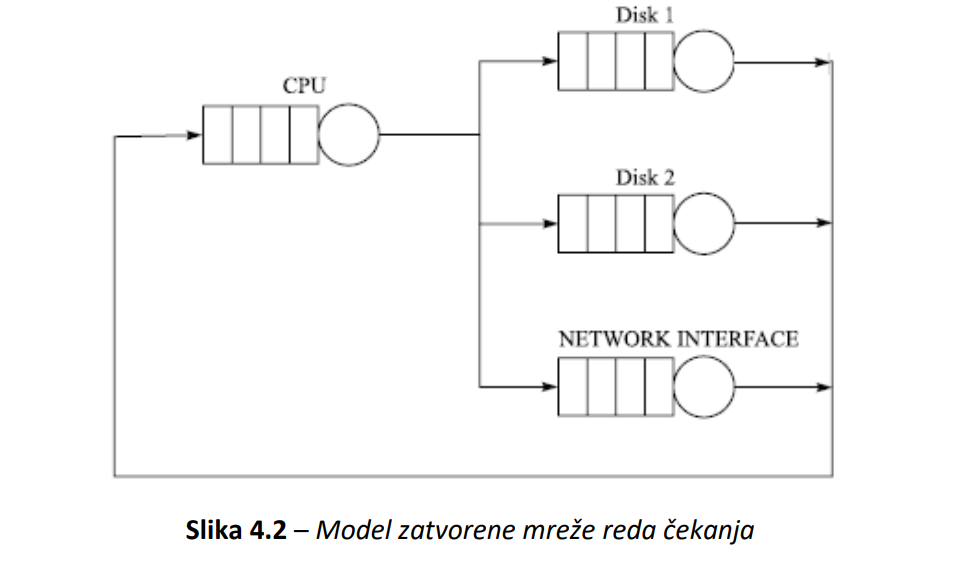
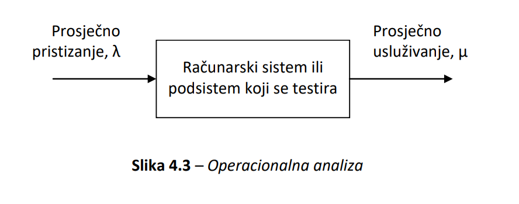
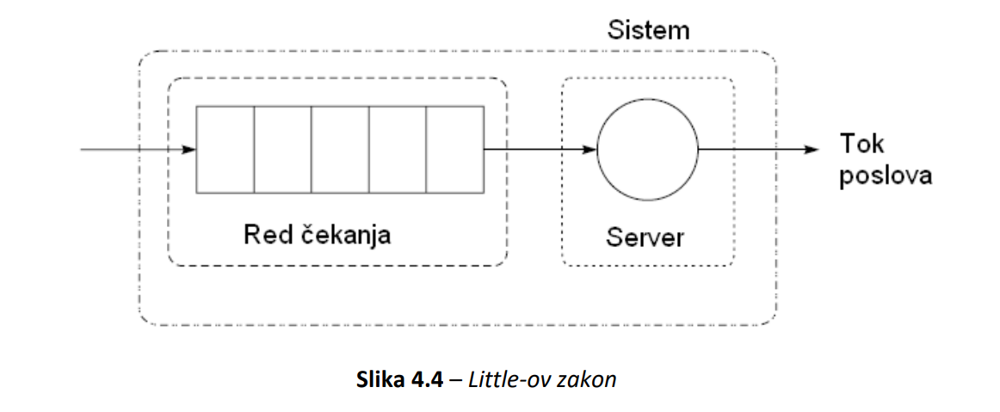
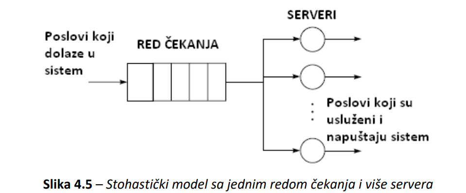

# PRS - Skripta v2.0
## 2. Mjerenje performansi
Analiza performansi u polju racunarske nauke i inzenjeringa predstavlja kombinaciju mjerenja, interpretacije i saopstavanja brzine/velicine racunarskog sistema. Termini "brzina" i "velicina" iskljucivo zavise od specificnosti situacije u kojima se mjere. Vecina performansi nekih dijelova racunarskog sistema direktno zavise od medjusobne interakcije sa drugim komponentama.

### 2.1. Ciljevi mjerenja performansi
1. Poredjenje alternativa - zadatak analiticara je da pruzi kvantitavinu informaciju o tome koja konfiguracija je najbolja pod specificnim uslovima
2. Utvrdjivanje uticaja nove komponente na postojeci sistem (*before-and-after* statisticka analiza)
3. Tuning sistema - odredjivanje grupe parametara pod kojima sistem ima najbolje ukupne performanse
4. Identifikovanje relativnih performansi - rezultat mjerenja dobija znacaj tek kada se poredi sa nekim drugim, postojecim sistemom
5. Debugging performansi - pronalazenje razloga zbog cega performanse nisu na zeljenom nivou
6. Postavljanje ocekivanja - odredjivanje realnih, ocekivanih rezultata mjerenja sistema na nivou komponente ili cijelog sistema

Rizik donosenja pogresne odluke mora da bude (inverzno) proporcionalan dubini izvrsene analize.

### 2.2. Tehnike mjerenja performansi
Postoje tri fundamentalne tehnike mjerenja performansi:
  1. Direktno mjerenje postojecih sistema - nije potrebno vrsiti pojednostavljujuce pretpostavke o sistemu, sto ju cini najpouzdanijom od tri navedene. Nedostatak se ogleda u fleksibilnosti nacina sprovodjenja mjerenja.
  2. Simulacija - odnosi se na program napisan sa svrhom da modeluje bitne detalje sistema koji se analizira. Glavni nedostatak se ogleda u nemogucnosti modelovanja svakog detalja sistema, sto ogranicava tacnost dobijenih rezultata.
  3. Analiticko modelovanje - predstavlja matematicki opis sistema. Rezultati, kao ovakvi, su najmanje povjerljivi i najmanje tacni, s tim da ova metoda daje najbrze (grube) rezultate.

### 2.3. Faze studije evaluacije performansi
Za razliku od nadgledanja racunarskog sistema, cija je glavna karakteristika kontinuirano pracenje realnog sistema, kod studije racunarski sistem uopste ne mora da postoji. Faze studije su grupisane u pet faza:
1. Identifikacije problema
2. Formulacija ciljeva
3. Priprema plana
4. Implementacija plana
5. Interpretacija rezultata

Treca, cetvrta i peta faza se mogu posmatrati kao iterativne komponente studije.

### 2.4. Metrika performansi
Osnovne karakteristike koje tipicno treba da se izmjere su: 
1. *Broj* koliko se puta desio neki dogadjaj
2. *Trajanje* nekog vremenskog intervala
3. *Velicina* nekog parametra.

Metrika performansi je vrijednost koja se koristi za opisivanje performansi sistema, a dobija se mjerenjem jedne od navedenih fundamentalnih karakteristika. Glavni problem koristenja razlicitih metrika performansi u istom testnom okruzenju dovodi do nekonzistentnosti i neuporedivosti rezultata. Zbog ovoga metrike performansi trebaju biti objektivne i kvantitabilne.  

Neke od klasa kvantifikovanja su:
1. Produktivnost (volumen, vrijeme) - Volumen informacija procesuiran u jedinici vremena.
   1. Npr. propusnost, kapacitet, maksimalan broj instrukcija...
2. Odziv (vrijeme) - Vrijeme izmedju ulaza i izlaza.
   1. Vrijeme odziva, vrijeme reakcije...
3. Iskoristivost (bezdimenziona) - Odnos vremena koje sistem provodi u nekoj specificnoj namjeni i ukupnog vremena.
   1. Hardverski moduli, sistemski softver, DBMS

Neke karakteristike dobrih metrika su:
1. Linearnost - vrijednost metrike treba da bude direktno proporcionalna stvarnim performansama sistema
2. Pouzdanost - sistem sa boljom metrikom mora uvijek raditi 'bolje' od sistema sa losijom metrikom.
3. Ponovljivost - svako mjerenje sistema mora dati istu ili krajnje slicnu metriku.
4. Lakoca upotrebe - sto je metrika teza za dobijanje, veca je vjerovatnoca pogresnog utvrdjivanja.
5. Konzistentnost - njena jedinica i precizna definicija mora biti isti u razlicitima sistemima i na razlicitim konfiguracijama u istom sistemu
6. Nezavisnost od vanjskih uticaja

### 2.5. Skale mjerenja
Skale se dijele u cetiri velike kategorije:
1. Nominalna
   -  Najnizi nivo mjerenja i cesto se koristi sa kvalitativnim varijablama umjesto sa kvantitativnim
   -  Rezultat mjerenja je kategorija kojoj pripadaju, sa tim da skala ne daje nikakav uvid u povezanost obuhvacenih kategorija
   -  Najcesca operacija koja se vrsi unutar ove skale mjerenja je brojanje objekata u nekoj od kategorija
   -  Dozvoljene statisticke metode su *modus* i *hi-kvadrat test*.
2. Ordinalna
     - Objekti se rangiraju na osnovu sadrzanog svojstva koje se mjeri
     - Skala ne daje uvid na pitanje razlike izmedju objekata, te da li ona postoji uopste.
     - Dozvoljena statisticka metoda je *median*.
3. Intervalska
      - Posjeduje osobinu za kolicinsko izrazavanje razlike izmedju objekata
      - Dozvoljene statisticke metode su *srednja vrijednost*, *standardna devijacija*, *korelacija*, *regresija* i *ANoVA*.
4. Odnosna
      - Sadrzi najvisi nivo suptilnosti: sadrzi sve osobine intervalske skale, kao i tacku apsolutne nule. 
      - Prednost u odnosu na intervalsku skalu je ta sto mozemo reci za A = 2B, tacnije da je B duplo manje od A, sto nije slucaj kao kod npr. Celsius-ove skale.
      - Dozvoljene statisticke metode su *sve dozvoljene na intervalskoj skali*, *geometrijska sredina*, *harmonijska sredina*, *koeficijent varijacije* i *logaritmi*.

### 2.6. Mjerne tehnike i alati
Posotji vise razlicitih tipova metrika performansi koje su predmet mjerneja. Dogadjaj se definise kao predefinisana promjena stanja sistema. Primjeri dogadjaja su referenciranje memorije, pristup disku, mrezna komunikacija i slicno. Dogadjaje mozemo klasifikovati kao:
1. Event-count (primary) metrike
      - Jednostavno broje koliko se puta odredjeni dogadjaj desio
2. Secondary-event metrike
      - Biljeze vrijednosti sekundarnih ili posljedicnih parametara prouzrokovane primarnim dogadjajem.
3. Profile
      - Agregaciona metrika koja se koristi za karakterizaciju sveukupnog ponasanja programa ili citavog sistema.

Alate za mjerenje mozemo kategorizovati na bazi fundamentalne strategije koja se koristi za utvrdjivanje vrijednosti metrike koja se mjeri. U strategije mjerenja spadaju:
1. Event-driven 
      - Biljezi informacije neophodne za izracunavanje metrike kad god se desi odredjen dogadjaj
      - Najjednostavniji primjer je brojac (npr. hitcount)
      - Pogodna za dogadjaje koji se rijetko pojavljuju
2. Tracing
      - Slicno kao i kod event-driven strategije, samo sto se skladisti 'snapshot' dijela ili cijelog sistema u tom trenutku.
3. Sampling (uzorkovanje)
      - Biljezi stanje sistema nakon fiksnih vremenskih intervala od pocetka mjerenja
      - Cilj je na osnovu skupljenih podataka odrediti metriku od interesa
4. Indirektna mjerenja
      - Mora se primijeniti kada metrika koja se zeli utvrditi nije direktno dostupna

Za skupljanje vise informacija o programu, potrebno je sto vise tacaka u kojima se vrsi mjerenje, sto smanjuje kvantitativnost performanse sistema.

## 2.7. Workload
Workload predstavljaju program, podaci i komande na osnovu kojih sistem proizvodi izlaz sa odredjenim nivoom performansi. Atributi workload-a se nazivaju workload parametri. (*korisnici -- 'workload' --> racunarski sistem -- 'performanse' ->*). Workload se definise kao grupa ulaza koje sistem prima iz okruzenja. Mjerenje performansi ima znacaj samo ako je workload pravilno specifikovan. U glavne karakteristike workload-a spadaju:
1. Reprezentativnost
2. Fleksibilnost
3. Jednostavnost konstrukcije
4. Kompaktnost
5. Troskovi upotrebe
6. Sistemska nezavisnost
7. Mogucnost reprodukcije
8. Kompatibilnost sa sistemom/modelom

Sve postojece workload-ove mozemo svrstati u dvije glavne grupe:
1. Prave - posmatra se na sistem koji se koristi za normalne operacije, nije ponovljiv i nema smisla da se koristi za testiranje.
2. Sinteticke - ima slicne karakteristike kao pravi, ali se dodatno moze ponavljati na kontrolisan nacin. Zbog toga se cesto koristi kao testni workload.
      - Glavni razlog za koristenje sintetickog workload-a je cinjenica da on predstavlja reprezentaciju modela pravog workload-a.
      - Nisu potrebni podaci iz realnih sistema, koji mogu biti ogromnih kolicina i neprakticni za testnu obradu.
      - Moze lako da se modifikuje bez uticaja na operisanje sistema koji se testira
      - Portabilan je.
      - Ima ugradjene mogucnosti za mjerenja.

Sljedeci tipovi workload-a se koriste za poredjenje racunarskih sistema:
1. Instrukcije sabiranja 
      - prvobitno na CPU, danas i na GPU (CUDA, Tensor) jezgrima.
2. Instrukcioni miksevi 
      - jedinice za poredjenje su MIPS i MFLOPS (I - Integer, FLO - FLoating Point). 
      - Najpoznatiji instrukcioni miks je Gibson-ov, 1959. godine.
3. Kerneli 
      - sa pojavom pipeline-a, kesiranja i raznih mehanizama za prevodjenje adresa, pogodnije je posmatrati skup instrukcija koje vrse neku uslugu procesora. 
      - Najcesca usluga je dobila naziv kernel. 
      - Neke od poznatih kernela su trazenje inverzne matrice, sortiranje, pretrazivanje stabla i slicno.
4. Sinteticki programi
      - Rjesavaju problem nedostatka I/O operacija kod kernela.
      - Prvi sinteticki program, tzv. testnu petlju, je kreirao Buchholz 1969. godine.
      - Glavna prednost ovakvih workload-ova je njihova mogucnost brzog razvijanja i brze isporuke.
      - Glavni nedostatak je njihova mala velicina, pa ne prave reprezentativna referenciranja memorije i diska.
5. Benchmark programi
      - Predstavljaju proces poredjenja dva ili vise sistema koristenjem workload-a.
      - U mogucnosti su da testiraju sve resurse sistema, pa su postali sinonim za workload.

Neke od strategija benchmarkinga su:
1. Mjerenje vremena potrebnog za izvodjenje fiksne kolicine operacija
2. Mjerenje kolicine operacija koje su izvedene za fiksnu kolicinu vremena
3. Dozvoljavanje da i vrijem i kolicina operacija variraju

Amdahl-ov zakon pokazuje da je poboljsanje ukupnih performansi sistema ograniceno dijelom sistema koji nije zahvacen promjenama. Glavne varijable su $T_{old}$ - staro vrijeme izvrsavanja i $T_{new}$ - novo/poboljsano vrijeme izvrsavanja. Ako se sa $\alpha$ oznaci kolicina sistema koja nije zahvacena promjenama, tada se $T_{new}$ moze podijeliti u dvije komponente:
   - $T_{1, new} = \alpha T_{old}$, vrijeme izvrsavanja dijela programa koji nije zahvacen promjenama
   - $T_{2, new} = (1 - \alpha)T_{old} * {q^{-1}}$, vrijeme izvrsavanja komponenti cije su performanse poboljsane faktorom $q$.
   - Pri cemu je $T_{new} = T_{1, new} + T_{2, new}$, a $q$ poboljsanje sistema.

Na osnovu tog razmatranja, mozemo izvesti formulu za ukupno ubrzanje sistema:
$$ 
S = \frac{T_{old}}{T_{new}} 
  = \frac{T_{old}}{T_{1,new} + T_{2,new}} 
  = \frac{T_{old}}{\alpha T_{old} + (1 - \alpha)T_{old} * q^{-1}}
  = \frac{T_{old}}{T_{old}(\alpha + (1 - \alpha)q^{-1})}
  = \frac{1}{\alpha(1 - q^{-1}) + q^{-1}}
$$

Ukoliko promjene izazovu ogromno poboljsanje, tacnije $q \rightarrow \infty$, onda vazi:
$$
\lim_{q \rightarrow \infty}{S} 
= \lim_{q \rightarrow \infty}{\frac{1}{\alpha(1 - q^{-1}) + q^{-1}}} 
= \alpha^{-1}
$$

Ovo pokazuje da je tzv. 'ogromno' poboljsanje sistema inverzno proporcionalno dijelu sistema nezahvacenim promjenama. Ako npr. $10\%$ programa ne mozemo paralelizovati, tada je maksimalno ubrzanje $\alpha^{-1} = (0.1)^{-1} = 10$ puta.

## 3. Simulacija
Kada sistem jos ne postoji, neophodno je napraviti mnoge pretpostavke o sistemu prije nego sto se on moze simulirati. Prednost simulacije je sto mnogo manje kosta od izgradnje ekvivalentne, stvarne masine. Nedostatak simulacije je naravno cinjenica da ne mjeri realan sistem, te stoga ne moze uzeti u obzir 'real-world' (spoljasnji) uticaj.

### 3.1. Vrste modela
Za predstavljanje realnog sistema koriste se razliciti modeli, npr. mentalni, verbalni, strukturni, fizicki, analogni, matematicki, simulacioni, racunarski i sl. Cesto se dijele na materijalne i simbolicke.  

Mentalni model je struktura koja ljudski mozak neprekidno konstruise kako bi bio u stanju da poveze niz cinjenica sa kojima se susrece. Verbalni modeli su direktna posljedica mentalnih modela i predstavljaju njihov izraz u govornom jeziku ili pisano (spadaju u klasu neformalnih modela).

Fizicki modeli predstavljaju umanjene modele realnog sistema sa maksimalno slicnim ponasanjem. Ukoliko su veze izmedju objekata realnog modela opisane matematickim relacijama, tada se govori o matematickim modelima.

Konceptualni modeli se stvaraju na osnovu predstave o strukturi i logici rada sistema ili problema koji se modelira, sa precizno definisanim znacenjem. Njihova posebna vaznost se ogleda u osnovi za izradu racunarskih modela.

Racunarski (simulacioni) model je prikaz konceptualnih modela u obliku programa za racunar. Modeli, kao takvi, postaju sredstvo kojim se moze efikasno analizirati rad modela u razlicitim spoljnim uslovima i sa razlicitim unutrasnjim parametrima.

#### 3.1.1. Neformalni i formalni modeli
Neformalni opis modela daje osnovne pojmove o modelu, iako to najcesce nije. Bitno je izvrsiti podjelu na objekte, opisne promjenljive i pravila interakcije objekata. *Objekti* su dijelovi iz kojih je model izgradjen. *Opisne promjenljive* opisuju stanja u kojima se objekti nalaze ili mogu naci. *Pravila interakcije objekata* definisu kako objekti modela uticu jedan na drugi u cilju promjene njihovog stanja.

Anomalije koje se javljaju prilikom neformalnog opisa su najcesce:
- Nekompletan opis modela - ne obuhvata sve moguce situacije,
- Nekonzistentan opis modela - postojanje kontradiktornih operacija za isti scenario,
- Nejasan opis modela - sistem ne specificira tacan postupak izvrsavanja operacija u odredjenom scenariju (*da li to bilo grananje ili slicno*).

Formalni opis modela treba obezbijediti vecu preciznost i potpunost u opisivanju modela, a ponekad omogucava i da se formalizuje postupak ispitivanja nekompletnosti, nekonzistentnosti i nejasnosti. 

Neke od opstih preporuka pri izgradnji modela su:
- Modeli sistema trebaju obuhvatati samo spoljne fenomene od interesa.
- Modeli trebaju sadrzati samo relevantne elemente sistema.
- Modele je razumno modularizovati.
- Preporucuje se koristenje nekog analitickog pristupa za razvijanje algoritama i programa.
- Potrebna je provjera logicke i kvantitativne ispravnosti modela, po modulima i kompletno.

### 3.2. Racunarska simulacija
Ponasanje modela se mora moci odrediti ili analiticki, ili numericki ili eksperimentalno (simulaciono). Savremeno modeliranje je nezamislivo bez racunara. Izraz modeliranje i simulacija izrazava slozenu aktivnost koja ukljucuje tri osnovna elementa: realni sistem, model i racunar, obuhvaceni relacijom:
$$
realni \ sistem \leftrightarrow model \leftrightarrow racunar
$$

Realni sistem podrazumijeva uredjen, medjuzavisan skup elemenata koji formiraju jedinstvenu cjelinu i djeluju zajednicki, kako bi ostvarili zadati cilj ili funkciju. Realni sistem je izvor podataka o ponasanju, a ovi se podaci javljaju u obliku zavisnosti $X(t)$, gdje je $X$ bilo koja promjenljiva od interesa, a $t$ mjereno vrijeme. 

Model ima svoje objekte koji se opisuju atributima ili promjenljivama. Ponasanje modela ne mora da bude u potpunosti jednako ponasanju simuliranog sistema, vec samo u onom domenu koji je od interesa.

Racunar predstavlja uredjaj sposoban za izvrsavanje instruckija modela, koje na bazi ulaznih podataka generisu razvoj modela u vremenu.

Modeliranje je proces kojim se uspostavlja veza izmedju realnog sistema i modela, dok je simulacija proces koji uspostavlja relaciju izmedju modela i racunara. Relacija modeliranja se odnosi na validnost modela. Validnost ili valjanost modela opisuje *koliko* je vjeran model simuliranom sistemu. 

### 3.3. Karakteristike simulacionog modeliranja
Racunarska simulacija je proces rjesavanja problema koji se tice predvidjanja i odredjivanja buducih stanja realnog sistema na osnovu proucavanja racunarskog modela sistema. Simulacioni eksperimenti se najcesce izvode sa ciljem prikupljanja odredjenih informacija, koje bi uvidio i realni sistem. Cilj simulacije je proucavanje ponasanja sistema koji se simulira, ali i utvrdjivanje kako bi se sistem ponasao kada bi na njega djelovao neki drugi skup promjenljivih okolnosti. 

Kod analitickih modela, rjesenje problema se dobija eksperimentisanjem nad modelom. Zbog slucajnog karaktera promjenljivih modela, za jednu vrijednost nezavisne promjenljive dobijamo vise razlicitih vrijednosti slucajne (zavisne) promjenljive. Po svojoj prirodi, proces izgradnje i koristenja simulacionih modela je blisko vezan za alate i tehnike racunarskih nauka i sistemske analize.

Potrebe za simulacijom se ogledaju u vise razloga:
- Eksperiment nad realnim sistemom moze biti skup ili cak nemoguc,
- Analiticki model nema analiticko rjesenje,
- Sistem moze da bude suvise slozen da bi se opisao analiticki,
- Modeliranje moze da ukaze na to da li je ulaganje u eksperiment isplativo ili ne,
- Modeliranje i simulacija ponekad imaju za cilj sporazumijevanje funkcionisanja ekvivalentnog realnog sistema,
- Varijacija skupa parametara je moguca kod modela, dok kod realnog sistema nije,
- Generalno, potrebno je dosta manje vremena za spoznaju rezultata kod simulacije nego kod eksperimentisanja sa realnim sistemom,
- Kod mjerenja rezultata realnog eksperimenta, uvijek postoji greska mjerenja, dok kod simulacije ne postoji

Neke od prednosti simulacije su:
- Jedan model se moze visestruko koristiti za analizu predlozenih ciljeva
- Simulacione metode se mogu koristiti kao pomoc kod analize
- Simulacioni podaci se dobijaju jeftinije od ekvivalentnih realnih podataka
- Analiticki model zahtijeva vise pojednostavljujucih pretpostavki, dok simulacioni modeli takva ogranicenja nemaju.

Neke od nedostataka simulacije su:
- Za simuliranje kompleksnijih domena problema, potrebno je vise vremena i sredstava
- Potrebno je izvodjenje visestrukih mjerenja za dobijanje vjerodostojnih rezultata
- Ne dobijaju se optimalna rjesenja, niti zavisnosti izlaznih promjenljivih od ulaznih promjenljivih
- Ocjenjivanje modela je dosta slozenije od ocjenjivanja realnog sistema

### 3.6 Simulacioni proces
Simulacioni proces je struktura rjesavanja stvarnih problema pomocu simulacionog modeliranja. Osnovni koraci simulacionog procesa su:
1. Definicija cilja simulacione studije - problem koji treba rijesiti, granice sistema/okoline, nivo detaljnosti
2. Identifikacija sistema - opis komponenti sistema, njihova interakcija, nacin rada, veza sa okolinom
3. Prikupljanje podataka o sistemu i njihova analiza 
4. Izgradnja simulacionog modela
5. Izgradnja simulacionog programa
6. Verifikacija simulacionog programa - testiranje, te ako pretpostavke nisu prihvatljive, ponovo se izgradjuje simulacioni program
7. Validacija simulacionog modela - da li model adekvatno predstavlja stvarni sistem, ako ne zadovoljava tada se ponovo izgradjuje
8. Planiranje simulacionih eksperimenata i njihovo izvodjenje
9. Analiza rezultata eksperimenata - ukoliko ne zadovoljavaju, tada se ponovo planira i sprovodi eksperiment
10. Zakljucci i preporuke

#### 3.7.1. Deterministicki i stohasticki modeli
Deterministicki modeli su oni cije se ponasanje moze predvidjeti, tacnije za stanje $S_n$ moguce je predvidjeti sljedece stanje $S_{n+1}$. Kod stohastickih modela, svako stanje $S_n$ vodi u skup stanja $S_{n+1} \in \{S^1_{n+1},\ S^2_{n+1}, \ \dots,\ S^m_{n+1} \}$. Za stohasticke modele je karakteristicno postojanje slucajnih promjenljivih u sistemu. Izvor slucajnosti takodje moze biti aktivnost sa slucajnim trajanjem, tj. sa trajanjem koje se odredjuje iz uniformne raspodjele vjerovatnoce. 

#### 3.7.2. Diskretni i kontinualni modeli
U diskretnim modelima, stanje sistema se mijenja samo u pojedinim tackama u vremenu, a takve pojave se nazivaju dogadjaji. U kontinualnim modelima promjenljive stanja se mijenjaju kontinualno u vremenu (npr. let aviona, ciji se polozaj i brzina mijenjaju kontinualno u vremenu - vrijeme je neprekidna promjenljiva).

### 3.8. Vrste simulacionih modela
Simulacione modele mozemo grupisati u 5 osnovnih kategorija, koje se razlikuju po pristupu modeliranja, klasi problema koja se rjesava, tehnikama modeliranja i odgovarajucih simulacija:
1. Emulacija - statisticka,
2. Monte Carlo simulacija - statisticka,
3. Kontinualna simulacija - dinamicka,
4. Simulacija diskretnih dogadjaja - dinamicka,
5. Mjesovita (kontinualno-diskretna) simulacija - dinamicka.

Kod statistickih simulacija ne postoji vremenska promjenljiva, tacnije simulacija se vrsi dok sistem ne dodje u neko vjerodostojno stanje (stanje ekvilibrijuma), poslije cega dalje izvodjenje simulacije nije korisno ili moguce.

Emulator je simulacioni program koji se pokrece na odredjenom sistemu sa svrhom da sistem izgleda kao neki drugi (npr. JVM, koji sluzi kao vCPU). Monte Karlo simulacija je povezana sa slucajnim fenomenima, kod koje se koristi uzorkovanje iz raspodjela slucajnih promjenljivih. Problemi kod Monte Karlo simulacije mogu biti i deterministickog i stohastickog karaktera. 

Kod MK simulacije, razlikujemo sljedece tipove primjene:
1. Deterministicki problemi koje je tesko/skupo rjesavati
   - Tipican primjer je racunanje odredjenih integrala koji se ne mogu rijesiti analiticki.
2. Slozeni fenomeni koji nisu dovoljno poznati
   - Nije poznat nacin uzajamnog djelovanja izmedju elemenata sistema, nego samo vjerovatnoce njegovog ishoda.
3. Statisticki problemi koji nemaju analiticka rjesenja
   - Specificna klasa, npr. procjene kriticnih vrijednosti ili testiranje novih hipoteza.

#### 3.8.3. Kontinualna simulacija
Koristi se za dinamicke probleme kod kojih se promjenljive stanja mijenjau kontinualno u vremenu. U prvoj klasi problema su relativno jednostavni problemi, koji nemaju drasticne promjene i prirodno se opisuju diferencijalnim jednacinama. U drugoj klasi su problemi koji nastaju opisom veoma slozenih, agregiranih sistema u kojim se niz elemenata sistema redukuje na manji broj komponenti i u kojima se promjene aproksimiraju konstantnim brzinama promjene.

Razlikujemo tri osnovna tipa kontinualnih simulacionih modela:
1. Modeli sistema obicnih diferencijalnih jednacina
2. Modeli koji se opisuju sistemima parcijalnih diferencijalnih jednacina
3. Modeli dinamike sistema (eng. *System Dynamics*)
   - Dinamika sistema je metodologija istrazivanja, modeliranja i simulacije slozenih dinamickih sistema.
   - Sistemi sa povratnom vezom su osnovni tip sistema koji se modeliraju dinamikom sistema, a povratna veza moze biti pozitivna ili negativna.
   - Novo stanje sistema se racuna na osnovu stanja u prethodnom trenutku vremena i razlike ulazno/izlaznih tokova za taj trenutak u vremenu.

#### 3.8.4. Simulacija diskretnih dogadjaja
Simulacija diskretnih dogadjaja je metoda simulacionog modeliranja sistema kod koje se diskretne promjene stanja dogadjaju diskontinualno u vremenu. Uglavnom se koristi za analizu dinamicikih sistema sa stohastickim karakteristikama. Kod ovakvog modela sistema uvedeni su i koncepti za opis dinamike:
1. Dogadjaj - diskretna promjena stanja entiteta u sistemu ili okruzenju
   1. Bezuslovni - jedini uslov je da tekuce vrijeme simulacije bude jednako vremenu njegovog nastupanja
   2. Uslovni - tek kada se ispuni uslov (lol)
2. Aktivnost - skup dogadjaja koji mijenjaju stanje jednog ili vise entiteta, tacnije skup dogadjaja
3. Proces - niz uzastopnih, logicki povezanih dogadjaja kroz koje prolazi neki privremeni objekat, tacnije skup aktivnosti

Entiteti koji se opisuju atributima i uzajamno djeluju ucestvujuci u aktivnostima pod odredjenim uslovima stvaraju dogadjaje koji mijenjaju stanja sistema. Simulator diskretnih dogadjaja se koristi za modelovanje sistema cije se globalno stanje mijenja kao funkcija vremena. Svaki ovakav simulator zahtijeva neku od sljedecih komponenata:
1. Rasporedjivac dogadjaja (event scheduler)
   - Odrzava listu svih dogadjaja u njihovom redu po globalnom vremenu
2. Globalna varijabla
   - npr. vremenske prirode, biljezi trenutno vrijeme izvodjenja simulacije, a moze se azurirati od strane rasporedjivaca na dva nacina (inkrementuje se po dogadjaju ili neuniformno)
3. Rutine za procesiranje dogadjaja
   - Svaki dogadjaj u sistemu tipicno ima svoju procesnu rutinu koja simulira sta bi se desilo da se dogadjaj nalazi u realnom sistemu
   - Ove rutine mogu da azuriraju globalno stanje ili cak da generisu dodatne dogadjaje i smijestaju u listu rasporedjivaca
4.  Mehanizmi za generisanje dogadjaja
    1.  Execution-driven
        - Slicna emulaciji (zapravo izvrsava benchmark program), s tim da simulator dodatno modeluje potrebne detalje sistema koji se testira
        - Obraca paznju i na to kako se dolazi do zeljenog izlaza
        - Smatraju se najtacnijim tipom simulacije
    2.  Trace-driven
        - Trace (trag) je sekvenca dogadjaja koji se odvijaju dok se sistem prati, a predstavlja samo jedno moguce izvrsavanje programa
        - Glavni nedostatak je malena kolicina generalnosti i teskoca rukovanja sa velikim trace fajlovima
    3.  Distribution-driven
        - Slican trace-driven, uz razliku sto ulazen dogadjaje generise sam simulator tako da oni prate neku predefinisanu funkciju vjerovatnoce
5. Rutine za biljeznje podataka i njihovo sumiranje 

#### 3.8.5. Mjesovita simulacija
Koristi se kada niti diskretna niti kontinualna simulacija ne moze u potpunosti da opise nacin rada sistema. Veza izmedju diskretnog i kontinualnog pristupa se postize uvodjenjem dva tipa dogadjaja: *vremenskih dogadjaja* i *dogadjaja stanja*. 

#### 3.8.6. Izbog tipa simulacionog modela
Tip simulacionog modela se najcesce bira da bude jednak tipu originalnog sistema, sto nije striktno obavezno. Najvaznija odluka pri izboru simulacionog modela je da bude sto jednostavniji i razumljiviji. 

### 3.9. Validacija i verifikacija
Problem validacije potice od cinjenice da je model uvijek uprostena slika realnog sistema koji predstavlja. Takodje, u model se gotov uvijek unose odredjene aproksimacije realnosti, sto proces validacije cini jos vaznijim. Postupak kojim se ispituje vjerodostojnost i preciznost modela se opisuje kroz dva koraka:
1. Verifikacija - koliko je simulacioni program konzistentan sa modelom
2. Validacija - da li je model precizna reprezentacija realnog sistema

Cesto se kaze da su izgradnja modela, verifikacija i validacija u dinamickoj povratnoj sprezi. 

Prvi korak u izgradnji modela obuhvata posmatranje realnog sistema i medjuinterakcija njegovih komponenti, kao i prikupljanje podataka o ponasanju sistema. Drugi korak je formiranje konceptualnog modela, skupa pretpostavki i hipoteza za vrijednosti parametara modela. Treci korak je pisanje simulacionog programa.

#### 3.9.1. Validacija simulacionih modela
Aproksimacije koje se najcesce pojavljuju kod simulacionih modela su:
1. Funkcionalna aproksimacija - izrazito nelinearne funkcije se aproksimiraju jednostavnijim
2. Aproksimacija raspodjele - realne vjerovatnoce se cesto aproksimiraju jednostavnijim raspodjelama
3. Aproksimacija nezavisnosti - pojedine komponente se modeluju kao nezavisne
4. Aproksimacija agregacije - vise elemenata se posmatra kao jedna cjelina
   1. Vremenska agregacija - svi diskretno-vremenski modeli (npr. 1 dan = 1 period)
   2. Medjusektorska agregacija
   3. Agregacija pomocnih sredstava 
5. Aproksimacija stacionarnosti - procesi koji se odvijaju infinitezimalan period vremena se posmatraju kao da su stacionarni, ukoliko je to prihvatljivo

Cilj procesa validacije je dvojak:
- Da proizvoede konzistentan i dovoljno blizak model eralnom sistemu
- Da pouzdanost modela poveca na prihvatljiv nivo

Prakticni pristup procesu validacije su formulisali *Naylor* i *Finger* 1976. godine:
1. Izgraditi vjerodostojan model
2. Potvrditi njegove pretpostavke
3. Uporediti I/O transformacije modela sa odgovarajucim realnim I/O transformacijama

Kod procjene validnosti modela, moze se koristiti i analiza osjetljivosti - postupak testiranja osjetljivosti moela na razlicite pretpostavke i promjene ulaznih velicina. 

Kod validacije pretpostavki modela, moguce ih je svrstati u dvije generalne kategorije:
1. Pretpostavke o strukturi - kako funkcionise sistem, pojednostavljenja i apstrakcije
2. Pretpostavke o podacima - zasnovane na statistickoj analizi podataka

Statisticka analiza podataka se uglavnom sastoji iz tri koraka:
1. Identifikacija odgovarajucih raspodjela dobijenih podataka
2. Procjena parametara izabrane raspodjele
3. Validacija pretpostavljenog statistickog modela nekim testom (*hi-kvadrat*, *Kolmogorov-Smirnov* test, itd.)

Struktura modela treba biti dovoljno precizna da model daje dobra predvidjanja za cijeli opseg skupova I/O podataka koji su od interesa. Da bi se izvrsila validacija I/O transformacije, neophodno je postojanje sistema koji se proucava. 

Homomorfizam predstavlja formalni kriterijum za utvrdjivanje validnosti uproscenog modela za date eksperimentalne uslove, u odnosu na osnovni model cije su karakteristike objasnjene ranije. Da bi se utvrdio homomorfizam, moraju biti ispunjeni sljedeci uslovi:
1. Ocuvanje funkcije nastupanja vremena - stanje $S$ u osnovnom modelu i njemu odgovarajuce stanje u uproscenom modelu $S^{'}$ moraju imati istu funkciju nastupanja vremena
2. Ocuvanje funkcije prelaza stanja - ukoliko neko stanje $S^{n}_s$ se preslikava u odgovarajuce stanje $S^{n}_b$, tada svako naredno stanje $S^{n+k}_s$ sa korijenom u $S^{n}_s$ se mora preslikavati u $S^{n+k}_b$, nekom funkcijom preslikavanja $\delta({S})$.
3. Ocuvanje izlazne funkcije - uprosceni i osnovni model moraju dati isti izlaz (izlazna funkcija za krajnja stanja oba modela mora dati isti izlaz).

#### 3.9.2. Verifikacija simulacionih modela
Proces verifikacije treba da pokaze da li je, i u kojoj mjeri, konceptualni model na odgovarajuci nacin predstavljen racunarskim kodom. U postupku verifikacije nema standardnog recepta:
- Rucna verifikacija logicke ispravnosti
- Modularno testiranje
- Provjera u odnosu na poznata rjesenja
- Testiranje osjetljivosti
- Testiranje na poremecaje

### 3.10. Generisanje slucajnih brojeva
U statistickoj teoriji se dokazuje da je slucajnu promjenljivu, sa zadatom raspodjelom, moguce generisati na osnovu jedne ili vise nezavisnih slucajnih promjenljivih sa uniformnom raspodjelom. Takvu slucajnu promjenljivu je moguce dobiti putem:
1. Manuelnih metoda - malog opsega, neprimjenljive u simulaciji
2. Tabele slucajnih brojeva
3. Metode za rad sa analognim racunarima - kompletno nedeterministicki sistem generisanja, za isti postupak ce uvijek dati razlicite rezultate
4. Metode za rad sa digitalnim racunarima 
   1. Koristenje fizickih izvora + A/D konverzija
   2. Koristenje table slucajnih brojeva
   3. Koristenje algoritama za dobijanje pseudoslucajnih brojeva

Algoritmi za generisanje pseudoslucajnih brojeva su brz nacin za generisanje slucajnih brojeva, s tim da njihov kvalitet zavisi od algoritma i racunara na kom se implementira. Od izbora algoritma zavisi i kvalitet generatora, pri cemu su najcesce u upotrebi kongruentni generatori. Kod pseudoslucajnih sekvenci je unaprijed poznata cijela sekvenca, ukoliko su poznati svi neophodni parametri. Dobar pRNG generator treba da posjeduje sljedece karakteristike:
1. Efikasnost
2. Dugacak period
3. Nezavisno i uniformno rasporedjene vrijednosti
4. Ponavljajuci

#### 3.10.5. Linearni kongruenti RNG (LCG)
LCG je jedan od najjednostavnijih generatora koji ispunjava sve navedene karakteristike, a koristi formulu: 
$$
z_i = (az_{i-1} + c) \ mod \ m
$$

pri cemu su $a$, $c$, i $m$ konstante. Vjerovatnoca dobijanja bilo koje vrijednosti je $m^{-1}$, a kada se vrijednost $z_k$ ponovi, tada se ponavlja cijela naredna sekvenca. Posto je u upotrebi uniformna raspodjela, najmanja razlika bilo koje dvije vrijednosti je takodje $m^{-1}$.

**Biranje konstanti**  

Posto period generatora ne moze biti veci od $m$, pozeljno je da ta vrijednost bude sto je moguce veca. Pogodno je da bude jednaka nekoj vrijednosti stepena $2$, tacnije $m = 2^{j}, \ j \in N$. Maksimalan period ce biti ostvaren ako su ispunjeni sljedeci uslovi:
1. $c \neq 0$ 
   1. $gcd(m,\ c) = 1$ 
   2. $\frac{m}{4} \in Z \rightarrow \frac{a-1}{4} \in Z$
      - *ako $4$ dijeli $m$, tada $4$ mora dijeliti i $a-1$.*

Ova ogranicenja su u potpunosti obuhvacena ako se konstante izaberu tako da je:
- $c \neq 0$
- $m = 2^j$
- $a = 4d + 1$
- $gcd(c,2) = 1$ - c je neparan broj
- ${j,d} \in N$ - pozitivni, cijeli brojevi

Ako se izabere $c = 0$, tada se period smanjuje sa $2^j$ na $2^{j-2}$. Ako je $j \in P$ (prost broj), tada se period generatora povecava na $2^j - 1$. Razlog za $-1$ je taj sto nikada ne moze da produkuje vrijednost jednaku nuli.

## 4. Analiza redova cekanja
Najvaznija analiticka tehnika za modelovanje u racunarskim sistemima. 

### 4.1. Modeli mreza
Glavna ideja koja stoji iza analize redova cekanja je da se razmisli o svim poslovima koji moraju da se izvrse u racunarskom sistemu. Server moze procesirati samo jedan posao u jednom trenutku - drugi poslovi koji zele da koriste zauzeti resurs moraju da cekaju u redu cekanja dok ne dodje do oslobadjanja resursa. Postoje dva tipa modela mreza redova cekanja: otvoreni i zatvoreni.

Kod otvorenog modela, poslovi stizu sa vanjskog izvora. Kod zatvorenog modela, postoji fiksan broj stalno-cirkulisucih poslova u mrezi.

### 4.2. Osnovne pretpostavke i notacija
Pretpostavke koje je potrebno utvrditi su:
- Balansiranje toka poslova - broj poslova koji pristignu na server u dovoljno velikom vremenskom intervalu mora biti jedan broju poslova koji napuste server
- One-step ponasanje - u bilo kojoj instanci vremena samo jedan posao moze da udje ili napusti server
- Homogenost - prosjecno pristizanje i usluzivanje poslova je nezavisno od stanja sistema
- Ekskluzivnost - posao moze biti prisutan samo na jednom serveru
- Nepostojanje blokiranja - uslugom kou pruza server ne moze da upravlja nijedan drugi uredjaj u sistemu
- Nezavisnost - poslovi ne smiju da uticu jedan na drugi na bilo koji nacin, kao niti da postoji bilo kakva prethodno-usaglasena sinhronizacija izmedju poslova

Notacija:
  + $s$, prosjecno vrijeme usluzivanja posla (service)
  + $r = avg(T_{inside}) + T_{waiting} + T_{served}$, prosjecno vrijeme odziva (response)
  + $w$, prosjecno vrijeme koje posao provede u redu cekanja (wait)
  + $q$, prosjecan broj poslova u redu cekanja (queue)
  + $n$, ukupan broj poslova u sistemu 
  + $U$, utilizacija/iskoristivost sistema - procenat ukupnog vremena u kom je sistem zauzet
  + $a$, broj pristizanja koja se dese u intervalu $T$ (arrival)
  + $d$, broj odlazaka koji se dese u nekom intervalu $T$ (departure)
  + $\mu = s^{-1}$, prosjecno usluzivanje
  + $\lambda$, prosjecno pristizanje (ukupan broj poslova koji je pristigao u intervalu T kroz taj interval)
  + $\rho = \frac{\lambda}{\mu}$, intenzitet saobracaja
  
  
### 4.3. Operacionalna analiza
U operacionalnoj analizi sistem se posmatra kao *black box* u kom poslovi dolaze na jednom kraju sistema, procesiraju se odredjeno vrijeme, te onda izlaze na drugom kraju. 

#### 4.3.1. Utilizacioni zakon
Prosjecno pristizanje dobijamo na osnovu pristiglih poslova i posmatranog vremenskog intervala: 
$$
\lambda = \frac{a}{T}
$$

Prosjecno pristizanje je reciprocno srednjem vremenu izmedju pristizanja dva posla. Jedinica za prosjecno pristizanje je broj poslova u jedinici vremena. Prosjecno usluzivanje $\mu$ je reciprocno prosjecnom vremenu usluzivanja jednog posla.

Prosjecna utilizacija sistema $U$ je procenat ukupnog vremena u kojem je sistem bio zauzet usluzivanjem poslova. Ako je $b$ ukupno vrijeme sistema u zauzetom stanju, tada je:
$$
U = \frac{b}{T}
$$

Ako se uzme da je $d$ broj usluzenih poslova u vremenskom intervalu $T$, tada takodje vazi:
$$
U = \frac{b}{d} * \frac{d}{T} = s\frac{d}{T}
$$

pri cemu je $s$ prosjecno vrijeme usluzivanja po poslu. Prosjecno usluzivanje $s$ mora biti jednako prosjecnom pristizanju $\lambda$, pa se dobija jednakost
$$
U = \lambda s
$$

Posto je prosjecno usluzivanje reciprocno prosjecnom vremenu usluzivanja, ovaj zakon se moze napisati i u sljedecem obliku:
$$
U = \lambda \mu^{-1} = \rho
$$
sto predstavlja intenzitet saobracaja. Ako je $\rho > 1$, slijedi da je $\lambda > \mu$, tj. prosjecno pristizanje je vece od prosjecnog usluzivanja (usko grlo).

#### 4.3.2. Little-ov zakon
Ako posmatramo dovoljno velik period $T$, vidjece se da u sistem ulazi $a$ poslova. Ako je ukupno kasnjenje/cekanje svih poslova u redu cekanja $D$, onda je prosjecno vrijeme cekanja jednog posla $w$ jednako:
$$
w = Da^{-1}, \ \lambda = aT^{-1} \leftrightarrow D = w \lambda T
$$

Sa druge strane, formula za ukupno kasnjenje se moze dobiti i kao proizvod prosjecnog broja poslova u redu cekanja i perioda $T$ u kojem se vrsi posmatranje:
$$
D = qT = w \lambda T \leftrightarrow q = w \lambda
$$

Navedeni izraz predstavlja Little-ov zakon, koji govori da prosjecan broj poslova u redu cekanja se moze dobiti kao proizvod prosjecnog vremena jednog posla provedenog u redu cekanja i prosjecnog pristizanja.

Postoje tri razlicite formulacije Little-ovog zakona:
1. $q = w\lambda$
2. $n = r\lambda$
3. $U = s\lambda$

### 4.4. Stohasticka analiza
Utilizacioni i Little-ov zakon pruzaju visokonivovski pogled na tok poslova kroz sistem, ne uzimajuci u obzir low-level detalje o tome sta se dogadja unutar sistema. Fundamentalni model stohastickog reda cekanja se sastoji od jednog ili vise servera koji procesiraju poslove iz jednog reda.

#### 4.4.1. Kendall-ova notacija
Stohasticki model reda cekanja moze da se potpuno specifikuje koristenjem 6 parametara: $A/S/c/B/N/D$, pri cemu:
- $A$ oznacava proces pristizanja poslova u red cekanja
  - Vremena $t_i = T_i - T_{i-1}$ se nazivaju vremena izmedju dolazaka
  - Najcesci proces koji se koristi u analizi redova cekanja je Poisson-ov proces, kod kog vremena izmedju dolazaka prate eksponencijalnu raspodjelu
  - Osobina ovakvog procesa je da pojava sljedeceg dogadjaja uopste ne zavisi od vremena pojavljivanja prethodnog dogadjaja - **memorylessness**
    - $M$ - eksponencijalna raspodjela (*geometrijska*)
    - $E$ - Erlang-ova raspodjela
    - $H$ - hipereksponencijalna raspodjela (*hipergeometrijska*)
    - $D$ - deterministicka raspodjela
    - $G$ - generalna slucajna raspodjela
- $S$ oznacava raspodjelu vremena potrebnih za usluzivanje poslova kada napuste red cekanja i predju na jedan od servera
  - Notacija je ista kao i kod notacija procesa pristizanja poslova u red cekanja ($A$)
- $c$ oznacava broj servera u sistemu
- $B$ oznacava ukupan broj poslova koji mogu da stanu u sistem, racunajuci i poslove u redu cekanja i poslove koji se usluzuju na serveru
- $N$ oznacava ukupan broj poslova koji bi ikad mogli da udju u sistem
- $D$ oznacava na koji nacin se poslovi izmjestaju izreda cekanja i smjestaju u server radi izvrsavanja (FCFS/FIFO, LCFS/LIFO, RR)

U vecini analiza se pretpostavljaju podrazumijevane vrijednosti za zadnja tri parametra: $(\infty, \infty, FCFS)$, pa se i ne pisu u specifikaciji Kendall-ove notacije. Na osnovu toga, dvije najpopularnije notacije su $M/M/1$ i $M/M/c$.

#### 4.4.2. M/M/1 sistemi
Analiza ovih sistema zapocinje sa pretpostavkom da poslovi stizu u redcekanja jedan-po-jedan, tj. da ne moze u jednom trenutku stici grupa poslova odjednom. Pristizanje posla u sistem se naziva rodjenje, a prouzrokuje tranziciju sistema iz stanja $n$ u stanje $n+1$. Slicno tome, kad server zavrsi sa usluzivanjem posla sistem prelazi iz stanja $n$ u $n-1$. Ovaj dogadjaj se popularno naziva smrt.

Za ispunjavanje uslova procesa Markovljevog lanca, moraju biti ispunjeni:
1. Stanje zavisi iskljucivo od trenutnog stanja
2. Sljedece stanje je potpuno nezavisno od vremenskog uticaja
3. Samo jedno rodjenje ili jedna smrt moze da se desi u jednom trenutku

Vjerovatnoca da se u sistemi nalazi $n$ poslova: $P_n = (1-\rho)\rho^{n}$, dok je prosjecan broj poslova u M/M/1 sistemu dobijamo izracunavanjem ocekivane vrijednosti $n$:
$$
E[n] = \sum_{n=0}^{\infty}{nP_n} = \frac{\rho}{1-\rho}
$$

Korespondirajuca varijansa za dobijeni broj poslova u sistemu je:
$$
Var[n] = \frac{\rho}{(1-\rho)^2}
$$

Iz Little-ovog zakona znamo da je prosjecan broj poslova u sistemu proizvod prosjecnog odzivnog vremena sistema i prosjecnog pristizanja:
$$
r = \frac{E[n]}{\lambda} = \frac{1}{\mu - \lambda}
$$

Posto se maksimalno jedan posao moze usluzivati u bilo kom trenutku, prosjecan broj poslova koji cekaju u redu moze se izracunati na sljedeci nacin:
$$
q = \sum_{n=1}^{\infty}{(n-1)P_n} = E[n] - \rho = \frac{\rho^2}{1 - \rho}
$$

Problem izracunavanja utilizacije servera se svodi na problem racunanja vjerovatnoce da se u sistemu nalazi minimalno jedan posao:
$$
U = 1 - P_0 = 1 - (1 - \rho) = \rho
$$

# 5. Interpretacija rezultata mjerenja